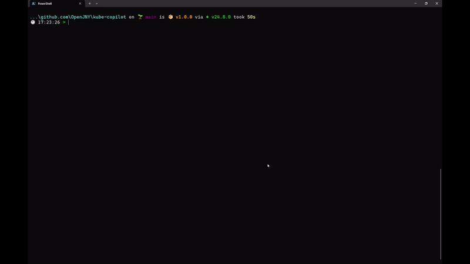
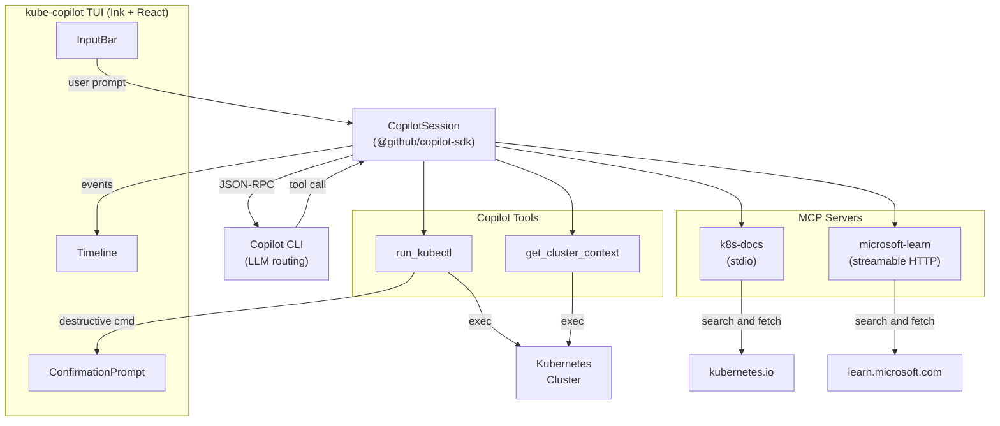

# kube-copilot

Talk to your Kubernetes cluster in natural language.

<p align="center">
  
  
  
</p>



## What is this?

**kube-copilot** is a terminal UI (TUI) that lets you manage Kubernetes clusters using natural language. No more memorizing `kubectl` flags — just say what you want in natural language and let Copilot figure out the rest.

```
💬 You: show me all pods that are failing in the production namespace
🤖 Copilot: Running `kubectl get pods -n production --field-selector=status.phase=Failed` ...
```

Built with [GitHub Copilot SDK](https://github.com/github/copilot-sdk) + [Ink](https://github.com/vadimdemedes/ink) (React for CLIs) + MCP servers for documentation lookup.

## Motivation

kubectl is powerful but has a steep learning curve. Even experienced engineers often end up Googling for the right flags and resource names. We wanted to bring the "just ask" experience of GitHub Copilot Chat directly into the terminal — where DevOps/SRE work actually happens.

## Key Features

| Feature                           | Details                                                                                          |
| --------------------------------- | ------------------------------------------------------------------------------------------------ |
| 🗣️ **Natural language → kubectl** | Describe what you want; Copilot translates it to the right command and runs it                   |
| 🔒 **Safety guardrails**          | Destructive commands (`delete`, `drain`, `cordon`, ...) require explicit user confirmation       |
| 📚 **Docs-grounded answers**      | Searches Kubernetes docs & Microsoft Learn via MCP before answering — no hallucinated advice     |
| 🎨 **Rich TUI**                   | Splash screen, timeline-style chat, markdown rendering, color-coded output — all in the terminal |
| 🔄 **Auto-reconnect**             | Session drops? It reconnects to Copilot automatically                                            |
| ⏱️ **Command timeout**            | kubectl commands auto-timeout at 30s to prevent hanging                                          |

## Architecture



## MCP Integration

Two MCP servers supply **real documentation** so Copilot can give grounded, accurate answers:

### 1. K8s Docs MCP (custom, stdio)

A custom MCP server built with `@modelcontextprotocol/sdk`.

- `search_k8s_docs` — search kubernetes.io by keyword
- `fetch_k8s_doc_page` — fetch & convert a K8s doc page to Markdown

### 2. Microsoft Learn MCP (remote, streamable HTTP)

Connects to `https://learn.microsoft.com/api/mcp`.

- `microsoft_docs_search` — search MS Learn docs
- `microsoft_code_sample_search` — find code samples
- `microsoft_docs_fetch` — fetch a full doc page

## Highlights & Design Choices

- **No API keys for LLM** — authentication is handled entirely through GitHub Copilot CLI. If you have a Copilot subscription (even Free tier), you're good to go.
- **React-based TUI (Ink)** — the entire UI is built with React components rendered in the terminal. This gave us composability and rapid iteration.
- **Timeline UI pattern** — chat messages, tool executions, and outputs are displayed in a unified timeline rather than separate panels, making it easy to follow multi-step reasoning.
- **Markdown in the terminal** — Copilot's responses are rendered as styled markdown (bold, headers, lists, code blocks) directly in the terminal.
- **Confirmation-based safety** — destructive kubectl commands go through a confirmation flow using React Context, so the agent can't accidentally nuke your cluster.

## Getting Started

### Prerequisites

- **Node.js** >= 18
- [**GitHub Copilot CLI**](https://docs.github.com/en/copilot/how-tos/set-up/install-copilot-cli) installed & authenticated
- **kubectl** installed and configured
- A Kubernetes cluster (local or remote)

### Run

```bash
npm install
npm run build
npm start
```

Or with npx:

```bash
npx kube-copilot
```

### Environment Variables

```bash
# No LLM API keys needed — Copilot CLI handles auth.
# Optional: for improved K8s docs search
K8S_DOCS_SEARCH_API_KEY=<your-google-custom-search-api-key>
```

## Development

```bash
npm run build   # compile app + MCP server
npm run dev     # dev mode with tsx
```

Since this is an Ink-based TUI, `console.log` doesn't work at runtime. Use the built-in file logger instead:

```ts
import { logger } from "./lib/logger.js";
logger.info("hello from kube-copilot");
```

Tail logs in a separate terminal:

```bash
tail -f debug.log
```

## Tech Stack

| Layer           | Technology                                                        |
| --------------- | ----------------------------------------------------------------- |
| LLM Integration | `@github/copilot-sdk` + Copilot CLI                               |
| MCP             | `@modelcontextprotocol/sdk` (custom server) + MS Learn remote MCP |
| TUI Framework   | Ink (React for terminals)                                         |
| Language        | TypeScript                                                        |
| Runtime         | Node.js                                                           |

## License

MIT
